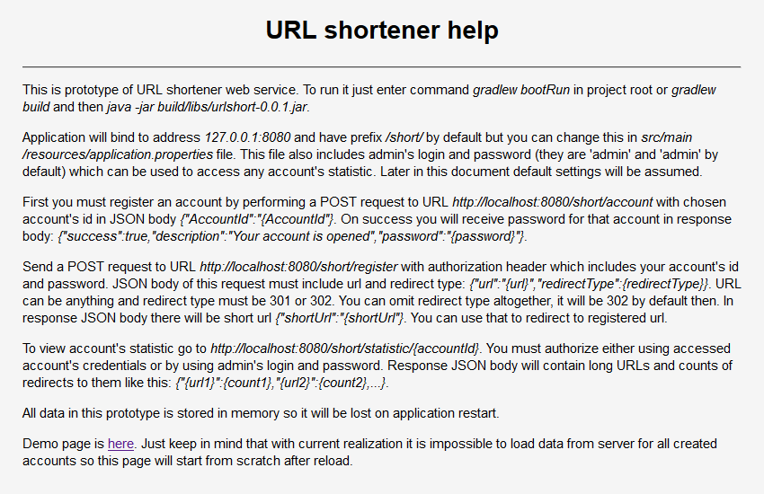

# Тестовое задание по Java "URL shortener"

Получено от Петра Арсентьева (http://job4j.ru/about.html).

Ниже привожу текст самого задания (перевод с английского).

Написать HTTP-сервис, предназначенный для создания коротких ссылок.
Он должен иметь следующую функциональность:

- Регистрация веб-адресов и генерация коротких ссылок.
- Перенаправление клиентских запросов согласно зарегистрированным коротким ссылкам.
- Выдача статистики использования.

**1. Базовая архитектура**

Сервис должен иметь две части: конфигурационную и пользовательскую.

*1.1. Конфигурационная часть*

К конфигурационной части доступ осуществляется посредством REST-вызовов
с данными в формате JSON, и ее предназначение в следующем:

- Открытие аккаунтов.
- Регистрация URL-адреса в сервисе.
- Отображение статистики.

***а) Открытие аккаунтов***

*HTTP-метод:* **POST**  
*URI:* **/account**  

*Тип запроса:* **application/json**  
*Тело запроса:*  
JSON-объект со следующими параметрами:

- AccountId (строка, обязательный параметр)  

Пример: `{AccountId: 'myAccountId'}`

*Тип ответа:* **application/json**  
*Тело ответа:*  
Случаи успешной и неуспешной регистрации должны различаться.
Неуспешная регистрация происходит только тогда, когда предоставленный
ID аккаунта уже существует. Параметры ответа следующие:

- success: true | false
- description: описание состояния, например: "account with that ID already exists"
- password: возвращается только в случае успешной регистрации. Должен
представлять собой автоматически созданный пароль длиной 8 численно-буквенных
символов.

Пример: `{success: 'true', description: 'Your account is opened', password: 'xC345Fc0'}`

***б) Регистрация URL-адресов***

*HTTP-метод:* **POST**  
*URI:* **/register**  

*Тип запроса:* **application/json**  
*Заголовки запроса:* **заголовок *Authorization* с токеном базовой аутентификации**  
*Тело запроса:*  
JSON-объект со следующими параметрами:

- url (обязательный параметр, должен содержать регистрируемый URL-адрес)
- redirectType: 301 | 302 (необязательный параметр, по умолчанию 302)

Пример: `{
             url: 'http://stackoverflow.com/questions/1567929/website-safe-data-access-architecture-question?rq=1',
             redirectType: 301
         }`

*Тип ответа:* **application/json**  
*Тело ответа:*  
Параметры ответа в случае успешной регистрации должны быть следующими:

- shortUrl (короткий URL-адрес)

Пример: `{ shortUrl: 'http://short.com/xYswlE'}`

***в) Получение статистики***

*HTTP-метод:* **GET**  
*URI:* **/statistic/{AccountId}**  
*Заголовки запроса:* **заголовок *Authorization* для аутентификации пользователя**  

*Тип ответа:* **application/json**  
*Тело ответа:*  
Ответ сервера представляет собой JSON объект с картой отображений, где ключ - это
зарегистрированный URL-адрес, а значение - количество перенаправлений по нему.

Пример: `{
             'http://myweb.com/someverylongurl/thensomedirectory/: 10,
             'http://myweb.com/someverylongurl2/thensomedirectory2/: 4,
             'http://myweb.com/someverylongurl3/thensomedirectory3/: 91,
         }`

*1.2. Перенаправление*

При отправке запроса по короткому URL-адресу должно осуществляться перенаправление
на сконфигурированный адрес со сконфигурированным HTTP-статусом.

**2. Основные требования**

- Использовать язык Java.
- Обратить внимание на то, что HTTP-статусы ответов должны соответствовать
стандартам REST (список статусов можно посмотреть здесь:
http://www.w3.org/Protocols/rfc2616/rfc2616-sec10.html).
- Сервис должен быть упакован в исполняемый или развертываемый пакет по вашему
выбору (war/jar).
- Приложение не должно требовать какой-либо дополнительной настройки, в том числе
оно не должно иметь никаких зависимостей помимо тех, что описаны в файле POM.
- При первом запуске приложение должно заработать прямо "из коробки" без дополнительных
телодвижений.
- Учитывая вышеприведенные требования, не позволяется использовать какие-либо
базы данных, разве что они будут встроены в само приложение.
- Разрешено использовать любые фреймворки.
- Создайте страницу с описанием по адресу **/help**, на которой будут содержаться
инструкции по установке, запуску и использованию.
- Предоставьте исходный код со всеми Java-зависимостями, желательно в виде Maven-проекта.

***

С Петром были оговорены следующие модификации данных требований:

- В качестве основного фреймворка использовать Spring Boot.
- В качестве инструмента сборки использовать gradle.
- Базы данных не использовать вообще, все данные хранить в памяти, чтобы в этом
задании продемонстрировать лишь умение работать с REST-архитектурой.
- Проект должен быть детально документирован с помощью JavaDoc, а также быть
покрыт тестами.

Для запуска достаточно ввести в корне проекта команду `gradlew bootRun`
и Spring Boot автоматически запустит встроенный tomcat-сервер с развернутым на нем
приложением, которое будет доступно по корневому адресу `http://localhost:8080/short/`.
Адрес, порт и корневой путь к приложению можно изменить в файле `src/main/resources/application.properties`.

Для получения исполняемого архива приложения в формате `jar` следует запустить команду
`gradlew build`. Искомый файл будет лежать здесь: `build/libs/urlshort-0.0.1.jar`.

Тесты запускает команда `gradlew test`. После этого в директории `build/reports/jacoco/test/html`
будет находиться отчет от плагина Jacoco о покрытии кода тестами.

После запуска приложения страница помощи будет доступна как по адресу `http://localhost:8080/short/`,
так и по адресу `http://localhost:8080/short/help`. Также реализована демо-страница, доступная по адресу
`http://localhost:8080/short/demo`. Только имейте ввиду, что в текущей реализации невозможно загрузить с сервера
информацию обо всех созданных аккаунтах, так что данная страница обнулится после перезагрузки.

**Страница помощи:**

**Список аккаунтов:**

**Создание аккаунта:**

**Список URL-адресов:**

**Регистрация URL-адреса:**

**Статистика:**

